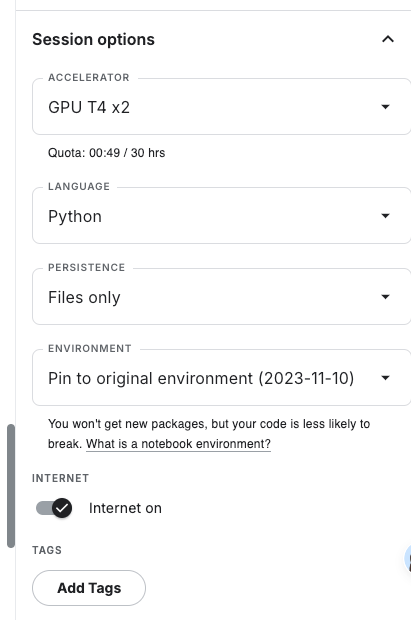

## comfyui jupyter

- [官方 demo](./jupyter/comfyui-kaggle.ipynb)

- [肖像大师](./jupyter/portrait-master.ipynb)

- [手绘转 3D](./jupyter/sketch_to_3d.ipynb)

### run in kaggle

> kaggle 每周有免费的 GPU 使用时长

点击这里注册[kaggle](https://www.kaggle.com/)

将仓库中的 notebook 在 kaggle 上创建完成后，按照下图选择 GPU 使用

